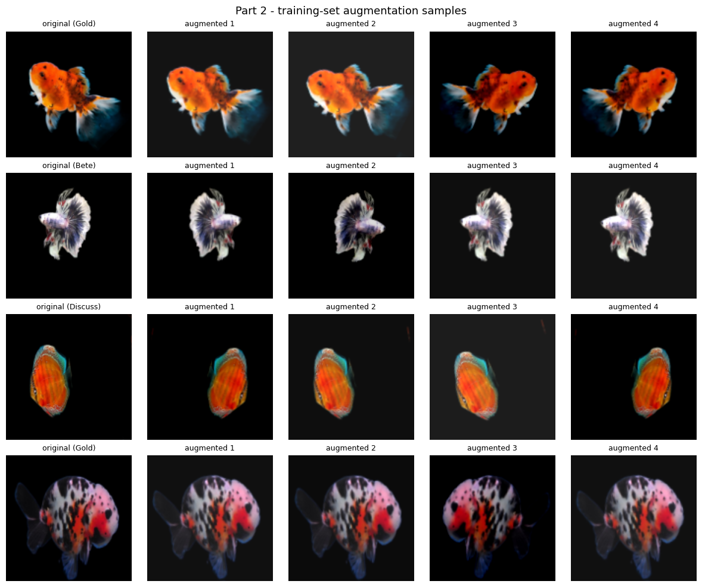
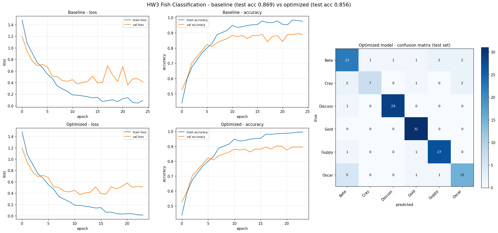
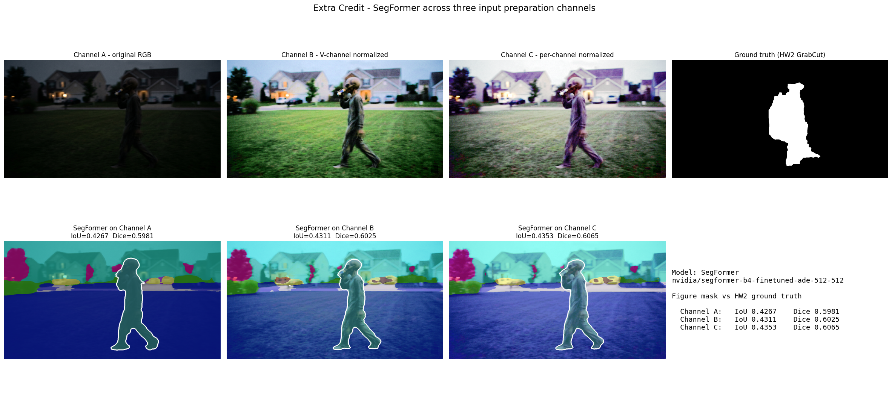

# AbdulAleemMohammed-CS898BA-Project1

**CS 898BA – Image Analysis and Computer Vision — Homework One**
Author: Abdul Aleem Mohammed

A single-script OpenCV pipeline that analyzes the low-light "alien" doorbell
capture, builds a full set of color-space / transformed / blurred variants, and
runs four edge-detection techniques over a random subset. The whole assignment
runs from one file: `main.py`.

---

## Setup

```bash
python -m venv .venv
source .venv/bin/activate        # Windows: .venv\Scripts\activate
pip install -r requirements.txt
```

## Run

```bash
python hello_world.py                       # prints "Hello World!"
python main.py --input alien_image.png      # runs the full pipeline
```

Generated images go to `output/` (git-ignored — regenerate by re-running). The
six README plots and the statistics report are written to the committed
`results/` folder. A fixed seed (`SEED = 898`) makes every run reproducible.

---

## Image-count checkpoints

The script prints a running count and a final summary so the spec's checkpoints
are verifiable. All counts are confirmed on disk:

| Stage | Required | Produced |
| --- | --- | --- |
| Base images (original, greyscale, binary, HSV, CIELAB, HLS, V-equalized→RGB) | 7 | 7 |
| After 2 unique affine transforms per image | 21 | 21 |
| After 7-level Gaussian blur | 168 | 168 |
| Chosen subset (168 ÷ 4) | 42 | 42 |
| After Sobel / Laplacian / Canny / Prewitt (42 inputs + 168 results) | 210 | 210 |
| Five-image comparison plots | 42 | 42 |

---

## Part 2 — Analysis and generation

### 2.1 Per-channel statistics

Computed with NumPy and `scipy.stats` and written to `results/statistics.txt`:

```
Channel    Min   Max     Mean  Median  Mode     Skew  Range      Std        Var
-------------------------------------------------------------------------------
Blue         0   255    20.87    10.0     3    1.690    255   25.975     674.73
Green        0   255    23.69    15.0    11    1.778    255   21.924     480.67
Red          0   255    19.64    11.0     2    2.137    255   22.158     490.99
```

The low means (~20/255) and strong positive skew (1.7–2.1) quantify what the eye
sees: this is a very dark, low-key image where most pixels sit near black, with a
long tail of brighter pixels from the porch lights and sky. This directly
motivates the V-channel histogram equalization in step 2.3.

### 2.2–2.5 Color spaces and lighting normalization

Greyscale, binary (threshold at 127), HSV, CIELAB, and HLS are generated and
saved. Histogram equalization is then applied to the **V** channel of the HSV
image (`cv2.equalizeHist`) to redistribute the compressed dark tones, and the
result is converted back to RGB. On this image the normalization noticeably
lifts the figure and houses out of the shadows. → **7 base images.**

### 2.6 Affine transforms

Each base image receives **2 unique** affine transforms, drawn from a fixed pool
of 14 transforms that are each distinct in type or value (rotations of 15–270°,
three translations, three scales, two shears). No two of the 14 are identical.
→ **21 images.**

### 2.7–2.8 Gaussian blur and the effect of σ

Every one of the 21 images is blurred at σ = 0.5, 1.0, 1.5, 2.0, 2.5, 3.0, 3.5.
As σ grows the kernel widens and averages over a larger neighborhood: at σ ≈ 0.5
only fine sensor noise is suppressed while edges stay crisp; by σ ≈ 1.5–2.5
small features and texture begin to dissolve; by σ ≈ 3.0–3.5 the figure smears
into the background. For a noisy night capture, a light blur (σ ≈ 1.0) is the
sweet spot — it removes speckle without destroying the silhouette we need for
detection. → **168 images total.**

---

## Part 3 — Edge detection

The 168 images are shuffled and split into 4 equal subsets of 42; the first is
chosen. Sobel, Laplacian, Canny, and Prewitt are applied to each, and both the
input (before) and all four results (after) are saved → **210 images**. A
five-panel comparison plot is produced for each of the 42 subset images; six are
exported below.

### Sample comparison plots

Each plot's title shows the exact processing chain of that subset image
(e.g. `greyscale_rotate_90_blur2.5`).


### Comparison and recommendation

| Technique | Pros | Cons |
| --- | --- | --- |
| **Sobel** | Cheap, gives gradient magnitude + direction, robust on smooth gradients | Thick edges, no thinning, somewhat noise-sensitive |
| **Laplacian** | Single-pass, omnidirectional second derivative | Very noise-sensitive (amplifies high frequencies), double edges |
| **Canny** | Multi-stage (smoothing → gradient → non-max suppression → hysteresis), thin clean edges when tuned | Threshold-dependent; with fixed high thresholds it drops weak edges entirely |
| **Prewitt** | Simple, uniform-weight gradient, similar coverage to Sobel | Noisier than Sobel, thick edges, no post-processing |

**Best technique for this image set: Sobel (with Prewitt close behind).** This is
the interesting result and it runs against the usual "Canny is best" reflex. On
this specific low-light, low-contrast set, **Canny produces almost nothing** — its
default 100/200 hysteresis thresholds are far too high for an image whose
gradients are tiny (means near 20/255), and the subset's blurred members weaken
those gradients further. Sobel and Prewitt, which output raw gradient magnitude
with no hysteresis gate, recover the figure's outline and the rooflines far more
completely. Laplacian picks up the shape too but is the noisiest of the four.

If Canny were required to win here, it would need its thresholds dropped
dramatically (e.g. ~20/60) and/or the V-equalized image as input rather than the
dark original — a good follow-up experiment.

---

## Repository layout

```
.
├── main.py                 # full Part 2 + Part 3 pipeline (single script)
├── hello_world.py          # initial-commit script
├── requirements.txt
├── .gitignore
├── AI_Log.md               # AI usage log
├── README.md
├── alien_image.png         # the assignment image
├── images/
│   ├── base/               # the 7 base images (committed)
│   ├── affine/             # the 14 affine transforms (committed)
│   └── plots/              # all 42 comparison plots (committed)
├── results/                # 6 README plots + statistics.txt (committed)
└── output/                 # 147 blurred + 210 edge images (git-ignored, regenerated on run)
```

---

# Homework Two — Image Segmentation

Branch: `Feature-Segmentation`. Builds on the HW1 pipeline to isolate the figure
from the background and measure how well each method does it.

## Run

```bash
python segmentation.py --input alien_image.png
```

Full outputs go to `segmentation_output/` (git-ignored). The comparison plot,
normalized image, ground truth, and metrics are committed to `results_hw2/`.

## Part 2 — Multi-channel normalization

Unlike HW1 (which equalized only the V channel of HSV), HW2 splits the image into
its B, G, R channels and applies histogram equalization to **all three
independently**, then merges them back. This maximizes contrast across the whole
spectrum and pulls the figure and houses out of the dark. A known side effect:
equalizing each channel independently breaks color constancy, which is why the
normalized image takes on a slight purple/green cast — the per-channel stretch
shifts the relative color balance. This normalized image is the input to every
segmentation method below.

## Part 3 — Threshold-based segmentation

- **Otsu global threshold** on the grayscale of the normalized image — picks one
  global cutoff automatically.
- **Adaptive Gaussian threshold** — computes a local cutoff per neighborhood
  (block size 31, C = 5).

Binary masks and the foreground extractions (`foreground_otsu.png`,
`foreground_adaptive.png`) are saved for both. Mask polarity is oriented so the
figure region is the white class.

## Part 4 — K-Means color clustering

The normalized image is converted to HSV and clustered with K-Means. K is chosen
automatically from {3, 4, 5} by silhouette score (K = 5 won). The cluster whose
pixels are densest inside the figure's region is selected as the figure, giving
`mask_kmeans.png` and `foreground_kmeans.png`.

## Part 5 — Evaluation

### Comparison plot


### Quantitative results (vs the GrabCut pseudo-ground-truth)

| Method | IoU (Jaccard) | Dice |
| --- | --- | --- |
| Otsu | 0.095 | 0.174 |
| Adaptive | 0.096 | 0.175 |
| **K-Means** | **0.103** | **0.187** |

The pseudo-ground-truth was built with a seeded GrabCut on the normalized image
(a vertical core of the figure marked as definite foreground, a wide border as
definite background), producing a clean head-torso-legs silhouette to score
against.

### Qualitative analysis

**Otsu** splits the frame into two big intensity regions. After full-spectrum
normalization the grass and figure are no longer uniformly dark, so Otsu floods
large background areas (sky, rooflines, parts of the lawn) as foreground. The
figure is captured but buried in false positives, which is why its IoU is low.

**Adaptive** thresholding responds to local contrast, so it traces texture and
edges everywhere — roof shingles, grass blades, the figure's outline. It
preserves the figure's contour better than Otsu but introduces heavy salt-and-
pepper noise across the whole scene, again hurting IoU.

**K-Means** is the best of the three (highest IoU and Dice). Because it clusters
in HSV color space rather than on raw intensity, it groups the figure's muted
clothing tones together and separates them from the green lawn and warm house
lights more cleanly than either threshold method. It still leaks onto similarly
colored background patches, so it is far from perfect.

**Effect of multi-channel normalization vs HW1.** In HW1 the raw, dark image gave
edge/threshold results dominated by noise and near-black regions. Equalizing all
three channels here dramatically raised contrast and made every method produce a
visible figure — but it also amplified background texture and shifted colors,
which is a double-edged sword: better visibility, but more background clutter for
the segmenters to wrongly include. The low absolute IoU values (~0.10) reflect
the genuine difficulty: a low-light, motion-blurred figure whose tones overlap
heavily with the dark grass is hard to isolate with classical methods. Color
clustering's edge over pure thresholding is the key takeaway.

## HW2 files

```
segmentation.py            # full Part 2–5 pipeline
results_hw2/
├── comparison_plot.png    # 6-panel comparison (in this README)
├── normalized_color.png   # Part 2 normalized image
├── ground_truth.png       # pseudo-ground-truth mask
└── metrics.txt            # IoU / Dice table
segmentation_output/       # all masks + foreground extractions (git-ignored)
```

---

# Homework Three — Deep Learning for Fish Classification

Branch: `Feature-Classification`. A custom CNN built from scratch in Keras that
classifies six fish species, plus a systematic hyperparameter search.

## Setup and run

```bash
pip install -r requirements.txt
```

Place the unpacked dataset in the repo root as `Fish/` (one folder per species),
then:

```bash
python classification.py --data Fish
```

The dataset and the decoded image cache are git-ignored. Outputs go to
`results_hw3/` and trained weights to `models/`. A fixed seed (`SEED = 898`)
makes runs reproducible. Full run takes roughly 30 minutes on a single CPU core.

## Part 2 — Data pipeline and augmentation

The dataset holds **1,016 images across 6 classes**, and it is noticeably
imbalanced:

| Class | Bete | Cray | Discuss | Gold | Guppy | Oscar |
| --- | --- | --- | --- | --- | --- | --- |
| Images | 194 | 80 | 201 | 207 | 189 | 145 |

Every image is decoded once, resized to **128 x 128**, and cached as an array so
training is not bottlenecked on disk I/O. Pixels are normalized to **[0, 1]**.
The data is split **70 / 15 / 15 stratified** (train 711, validation 152, test
153), so every class keeps its proportion in all three sets.

Augmentation is applied to the **training set only**: random horizontal flip,
minor rotation (±6%), and brightness jitter (±15%).



## Part 3 — Baseline CNN

Four convolutional blocks with increasing filters, each followed by max-pooling,
then a dense head — **2,339,782 trainable parameters**:

```
Input 128x128x3
Conv2D(32, 3x3, ReLU)  -> MaxPool
Conv2D(64, 3x3, ReLU)  -> MaxPool
Conv2D(128, 3x3, ReLU) -> MaxPool
Conv2D(128, 3x3, ReLU) -> MaxPool
Flatten -> Dense(256, ReLU) -> Dropout(0.3) -> Dense(6, softmax)
```

Trained with **Adam, learning rate 0.001, batch size 32, for a fixed 25 epochs**.
It ended at 97.5% training accuracy against 88.8% validation accuracy (best
validation accuracy 89.5%), which is a clear but moderate overfitting gap.
Weights are saved to `models/baseline_model.keras`.

## Part 4 — Hyperparameter optimization

**Strategy: seeded Random Search** over a 12-point grid — learning rate
{0.01, 0.001, 0.0001} × batch size {32, 64} × dropout {0.3, 0.5}. Eight of the
twelve configurations were sampled (10 epochs each), and the sample covers all
three learning rates, both batch sizes, and both dropout rates.

| Rank | Learning rate | Batch | Dropout | Val loss | Val accuracy |
| --- | --- | --- | --- | --- | --- |
| 1 | 0.001 | 32 | 0.3 | **0.4154** | 0.8487 |
| 2 | 0.001 | 32 | 0.5 | 0.4546 | 0.8487 |
| 3 | 0.001 | 64 | 0.5 | 0.4768 | 0.7961 |
| 4 | 0.0001 | 32 | 0.3 | 0.7273 | 0.7171 |
| 5 | 0.0001 | 64 | 0.3 | 0.8562 | 0.6579 |
| 6 | 0.01 | 64 | 0.3 | 0.9424 | 0.6447 |
| 7 | 0.01 | 32 | 0.5 | 1.0570 | 0.6053 |
| 8 | 0.01 | 64 | 0.5 | 1.1050 | 0.5987 |

The winning configuration on validation loss was **lr = 0.001, batch = 32,
dropout = 0.3**. It was then retrained for up to 40 epochs with
`ReduceLROnPlateau` and early stopping (patience 12, best weights restored); it
ran 24 epochs and reached a peak validation accuracy of **90.1%**, saved to
`models/optimized_model.keras`.

## Part 5 — Evaluation and analysis

### Visualization



### Quantitative comparison (held-out test set, 153 images)

| Model | Accuracy | Precision (macro) | Recall (macro) | F1 (macro) |
| --- | --- | --- | --- | --- |
| Baseline | **0.8693** | 0.8487 | **0.8515** | **0.8480** |
| Optimized | 0.8562 | **0.8544** | 0.8202 | 0.8311 |

Per-class results for the optimized model:

| Class | Precision | Recall | F1 | Support |
| --- | --- | --- | --- | --- |
| Bete | 0.7097 | 0.7586 | 0.7333 | 29 |
| Cray | 0.8750 | 0.5833 | 0.7000 | 12 |
| Discuss | 0.9667 | 0.9667 | 0.9667 | 30 |
| Gold | 0.8857 | 1.0000 | 0.9394 | 31 |
| Guppy | 0.9000 | 0.9310 | 0.9153 | 29 |
| Oscar | 0.7895 | 0.6818 | 0.7317 | 22 |

### Qualitative analysis

**Effect of augmentation on training stability.** The horizontal flips and small
rotations were the useful part of the augmentation set: fish appear facing either
direction and at slight angles across the dataset, so those transforms match real
variation rather than inventing it. Brightness jitter matters because the images
come from aquarium tanks with very different lighting. The measurable effect is
on the shape of the curves — validation accuracy climbs steadily instead of
spiking and collapsing, and the training and validation curves stay close for the
first ten epochs or so. What augmentation did **not** do is eliminate
overfitting: training accuracy still reached 99% while validation plateaued near
89%. With only 711 training images, a 2.3M-parameter network memorizes the
training set regardless.

**Which hyperparameters mattered.** Learning rate dominated everything else:

- **lr = 0.001** — validation loss 0.415 to 0.477 (all top three trials)
- **lr = 0.0001** — 0.727 to 0.856 (converging, but far too slowly for 10 epochs)
- **lr = 0.01** — 0.942 to 1.105 (unstable; the loss bounced instead of descending)

Batch size was second: batch 32 averaged 0.664 validation loss against 0.845 for
batch 64. On a dataset this small, the smaller batch gives more than twice as
many gradient updates per epoch, which matters when the epoch budget is fixed.
Dropout mattered least — 0.3 averaged 0.735 against 0.773 for 0.5. At this model
size, 0.5 removes enough signal to slow convergence without buying much
generalization.

**An honest note on the comparison.** The search found that the baseline's
default configuration was *already* the best point in the grid, so the optimized
model differs from the baseline only by its learning-rate schedule and early
stopping rather than by different hyperparameters. On the test set the two land
within 2 images of each other out of 153 (86.9% vs 85.6%), which is inside
run-to-run noise for a test set this size; the optimized model is slightly ahead
on macro precision and reached a higher peak validation accuracy (90.1% vs
89.5%), while the baseline is slightly ahead on recall. The correct conclusion is
not that tuning failed but that the standard Adam defaults were already near
optimal for this architecture, and that the remaining error is a data problem
rather than a hyperparameter problem.

A useful failure worth recording: the first attempt at the optimized model used
early stopping on validation loss with patience 8. It halted at epoch 10 and
restored weights from that epoch, even though validation *accuracy* was still
improving through epoch 14, so the model was truncated while undertrained and
scored only 81.1% on the test set. Adding `ReduceLROnPlateau` and raising the
patience to 12 fixed it. Validation loss is a noisier early-stopping signal than
it looks.

**Where the errors actually are.** The confusion matrix concentrates the mistakes
in exactly the places the class distribution predicts. Gold (31/31) and Discuss
(29/30) are nearly perfect — both have over 200 training images and a distinctive
colour and body shape. Cray has the lowest recall at 0.583, and it is also the
smallest class with only 80 images. Oscar is the other weak class, and five of
its seven errors are predicted as Bete; both are dark, patterned, similarly
shaped fish, so this is a genuine visual confusion rather than a training
artifact.

The clear next steps would be class weighting or oversampling for Cray, more data
for the two weak classes, and transfer learning from a pretrained backbone, which
would help far more than further tuning of these three hyperparameters.

## HW3 files

```
classification.py             # full Part 2-5 pipeline
models/
├── baseline_model.keras      # Part 3 baseline weights
└── optimized_model.keras     # Part 4 best configuration
results_hw3/
├── training_comparison.png   # curves for both models + confusion matrix
├── augmentation_samples.png  # Part 2 augmentation evidence
├── hyperparameter_search.txt # full random-search table
├── metrics_summary.txt       # baseline vs optimized
├── classification_report_baseline.txt
├── classification_report_optimized.txt
├── confusion_matrix_optimized.csv
└── history.json              # per-epoch histories + trial records
Fish/                         # dataset (git-ignored, add locally)
```
---

# Extra Credit — Advanced Segmentation (SegFormer)

Branch: `Advanced-Segmentation`. The same unidentified-figure image from
Homeworks 1 and 2 is segmented by a hierarchical transformer instead of the
classical methods, across three input preparation channels.

## Chosen architecture

**SegFormer** — `nvidia/segformer-b4-finetuned-ade-512-512`, the ADE20K-finetuned
checkpoint. SegFormer pairs a hierarchical Mix Transformer encoder (multi-scale
features, no positional encodings) with a lightweight all-MLP decoder, so it
reasons about global scene context rather than the purely local intensity
statistics the Homework 2 methods relied on. The figure is isolated by taking the
`person` class from the 150-class ADE20K label space, which is the category a
human annotator would assign to it.

## Run

```bash
pip install -r requirements.txt
python advanced_segmentation.py --image alien_image.png \
    --ground-truth results_hw2/ground_truth.png
```

## Part 2 — the three input channels

| Channel | Preparation |
| --- | --- |
| A (Baseline) | original, unmodified RGB |
| B (Perceptual transformation) | V channel of HSV histogram-equalized, converted back to RGB |
| C (Statistical contrast normalization) | each RGB channel histogram-equalized independently |

## Part 3 — results



Predicted figure mask scored against the Homework 2 GrabCut pseudo-ground-truth:

| Input | IoU | Dice |
| --- | --- | --- |
| Channel A — original RGB | 0.4267 | 0.5981 |
| Channel B — V-channel normalized | 0.4311 | 0.6025 |
| Channel C — per-channel normalized | **0.4353** | **0.6065** |

For reference, the classical Homework 2 results on the same ground truth:

| Method | IoU | Dice |
| --- | --- | --- |
| Otsu (HW2) | 0.0952 | 0.1739 |
| Adaptive (HW2) | 0.0961 | 0.1754 |
| K-Means (HW2) | 0.1032 | 0.1871 |

## Part 4 — analysis

### Against Homework 2

The transformer is not incrementally better than the classical pipeline, it is
categorically better. The weakest SegFormer channel (IoU 0.4267) still beats the
strongest Homework 2 method (K-Means, IoU 0.1032) by more than four times, and
the best channel reaches **4.22× the IoU and 3.24× the Dice** of K-Means.

The reason is what each method is actually looking at. Otsu, adaptive
thresholding and K-Means all partition pixels by value — intensity or colour.
On a dusk frame where the figure's clothing sits in the same tonal range as the
unlit lawn, no threshold or cluster boundary exists that separates them, so those
methods inevitably swept in large regions of grass, sky and rooflines. Their low
scores were a property of the problem, not a bug in the implementation.
SegFormer assigns a semantic label per pixel using multi-scale context, so it
recognises a person-shaped region by structure and its relationship to the
surrounding scene rather than by whether its pixels are brighter or darker than
a cutoff. Contrast is no longer the deciding signal.

### Effect of the input channel

The ranking is C (0.4353) > B (0.4311) > A (0.4267), so contrast normalization did
help, and the ordering is monotonic with how aggressively contrast was enhanced.
But the far more interesting result is **how little it mattered**: the spread from
the untouched baseline to the most heavily normalized input is 0.0086 IoU, about
**2% relative**. The transformer is essentially indifferent to which of the three
inputs it receives.

That is a direct inversion of the Homework 2 finding. There, multi-channel
normalization was not a refinement but a prerequisite — the raw dark frame
produced almost nothing usable, and every classical method depended on the
contrast stretch to have any signal to threshold or cluster at all. Here the
preprocessing that was essential becomes nearly irrelevant, because a model
trained on a large photograph corpus has already learned features that are robust
to exposure. The practical lesson is that heavy input engineering is a way of
compensating for a weak model, and it stops paying off once the model itself
carries the semantic prior.


### Did the model actually recognise the figure?

Yes, and unambiguously. The diagnostic check scores every one of the 150 ADE20K
classes against the ground truth and reports the best match; for all three
channels the winner was `person`, at exactly the same IoU as the target-class
result:

| Channel | Best-overlapping predicted class | IoU |
| --- | --- | --- |
| A | `person` | 0.4267 |
| B | `person` | 0.4311 |
| C | `person` | 0.4353 |

This matters because it rules out the alternative explanation for a mid-range
score. The model did not mistake the figure for a tree, a statue or a background
region and then coincidentally overlap it; the person class is genuinely the best
available description of those pixels. Despite the assignment framing the subject
as an unidentified or anomalous figure, SegFormer resolved it to a person from
every input variant, which is itself the answer to the out-of-distribution
question the experiment was set up to probe.

### Why the score is 0.43 and not higher

An IoU of 0.44 sounds unimpressive in absolute terms, but the reference mask sets
a ceiling on it. The ground truth is the GrabCut estimate produced in Homework 2,
not a hand-drawn annotation: it is a smoothed blob that follows the figure's
silhouette loosely and includes some surrounding background near the boundary.
SegFormer's mask is tighter and follows the limbs more closely, so a substantial
part of the disagreement is the transformer being *more* precise than the
reference it is scored against, which the metric punishes. These numbers measure
agreement with a rough estimate rather than absolute accuracy, and the true
segmentation quality is very likely better than 0.44 suggests. Confirming that
would need a hand-annotated mask, which is the obvious next step.

The remaining genuine error sources are the motion blur across the figure's legs
and the extremely low light, both of which soften the boundary that any
segmentation method has to find.

## Extra credit files

```
advanced_segmentation.py          # full pipeline
EC_Colab.ipynb                    # one-click Colab runner
results_ec/
├── advanced_comparison.png       # the required comparison plot
├── overlay_channel_[ABC].png     # multi-coloured semantic overlays
├── mask_channel_[ABC].png        # binary figure masks
├── input_channel_[ABC].png       # the three prepared inputs
├── metrics.txt                   # IoU / Dice table
└── metrics.json                  # machine-readable results
```
