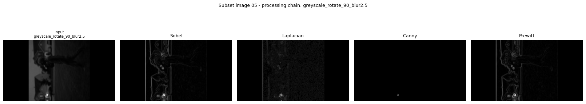
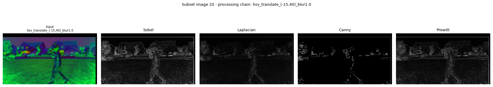
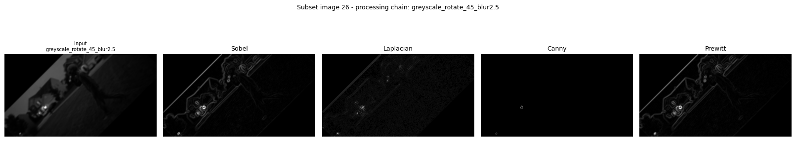
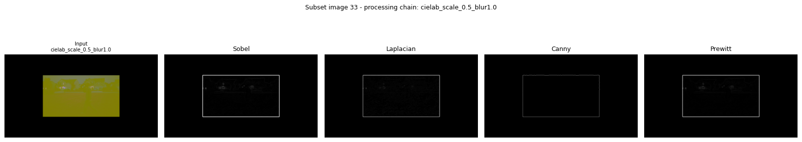
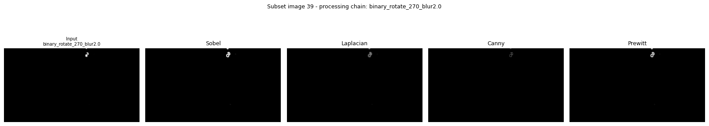
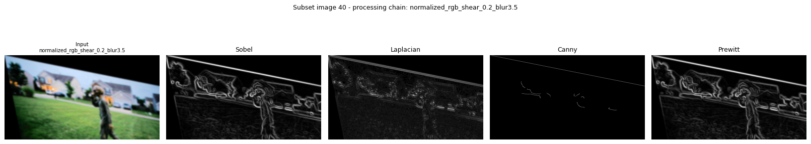
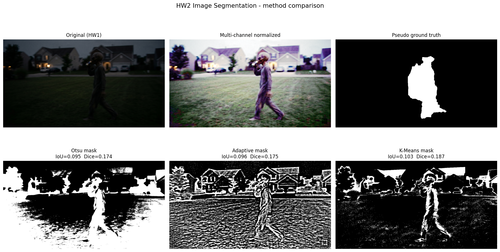

# AbdulAleemMohammed-CS898BA-Project1

**CS 898BA – Image Analysis and Computer Vision — Homework One**
Author: Abdul Aleem Mohammed

A single-script OpenCV pipeline that analyzes the low-light "alien" doorbell
capture, builds a full set of color-space / transformed / blurred variants, and
runs four edge-detection techniques over a random subset. The whole assignment
runs from one file: `main.py`.

---

## Setup

```bash
python -m venv .venv
source .venv/bin/activate        # Windows: .venv\Scripts\activate
pip install -r requirements.txt
```

## Run

```bash
python hello_world.py                       # prints "Hello World!"
python main.py --input alien_image.png      # runs the full pipeline
```

Generated images go to `output/` (git-ignored — regenerate by re-running). The
six README plots and the statistics report are written to the committed
`results/` folder. A fixed seed (`SEED = 898`) makes every run reproducible.

---

## Image-count checkpoints

The script prints a running count and a final summary so the spec's checkpoints
are verifiable. All counts are confirmed on disk:

| Stage | Required | Produced |
| --- | --- | --- |
| Base images (original, greyscale, binary, HSV, CIELAB, HLS, V-equalized→RGB) | 7 | 7 |
| After 2 unique affine transforms per image | 21 | 21 |
| After 7-level Gaussian blur | 168 | 168 |
| Chosen subset (168 ÷ 4) | 42 | 42 |
| After Sobel / Laplacian / Canny / Prewitt (42 inputs + 168 results) | 210 | 210 |
| Five-image comparison plots | 42 | 42 |

---

## Part 2 — Analysis and generation

### 2.1 Per-channel statistics

Computed with NumPy and `scipy.stats` and written to `results/statistics.txt`:

```
Channel    Min   Max     Mean  Median  Mode     Skew  Range      Std        Var
-------------------------------------------------------------------------------
Blue         0   255    20.87    10.0     3    1.690    255   25.975     674.73
Green        0   255    23.69    15.0    11    1.778    255   21.924     480.67
Red          0   255    19.64    11.0     2    2.137    255   22.158     490.99
```

The low means (~20/255) and strong positive skew (1.7–2.1) quantify what the eye
sees: this is a very dark, low-key image where most pixels sit near black, with a
long tail of brighter pixels from the porch lights and sky. This directly
motivates the V-channel histogram equalization in step 2.3.

### 2.2–2.5 Color spaces and lighting normalization

Greyscale, binary (threshold at 127), HSV, CIELAB, and HLS are generated and
saved. Histogram equalization is then applied to the **V** channel of the HSV
image (`cv2.equalizeHist`) to redistribute the compressed dark tones, and the
result is converted back to RGB. On this image the normalization noticeably
lifts the figure and houses out of the shadows. → **7 base images.**

### 2.6 Affine transforms

Each base image receives **2 unique** affine transforms, drawn from a fixed pool
of 14 transforms that are each distinct in type or value (rotations of 15–270°,
three translations, three scales, two shears). No two of the 14 are identical.
→ **21 images.**

### 2.7–2.8 Gaussian blur and the effect of σ

Every one of the 21 images is blurred at σ = 0.5, 1.0, 1.5, 2.0, 2.5, 3.0, 3.5.
As σ grows the kernel widens and averages over a larger neighborhood: at σ ≈ 0.5
only fine sensor noise is suppressed while edges stay crisp; by σ ≈ 1.5–2.5
small features and texture begin to dissolve; by σ ≈ 3.0–3.5 the figure smears
into the background. For a noisy night capture, a light blur (σ ≈ 1.0) is the
sweet spot — it removes speckle without destroying the silhouette we need for
detection. → **168 images total.**

---

## Part 3 — Edge detection

The 168 images are shuffled and split into 4 equal subsets of 42; the first is
chosen. Sobel, Laplacian, Canny, and Prewitt are applied to each, and both the
input (before) and all four results (after) are saved → **210 images**. A
five-panel comparison plot is produced for each of the 42 subset images; six are
exported below.

### Sample comparison plots

Each plot's title shows the exact processing chain of that subset image
(e.g. `greyscale_rotate_90_blur2.5`).








### Comparison and recommendation

| Technique | Pros | Cons |
| --- | --- | --- |
| **Sobel** | Cheap, gives gradient magnitude + direction, robust on smooth gradients | Thick edges, no thinning, somewhat noise-sensitive |
| **Laplacian** | Single-pass, omnidirectional second derivative | Very noise-sensitive (amplifies high frequencies), double edges |
| **Canny** | Multi-stage (smoothing → gradient → non-max suppression → hysteresis), thin clean edges when tuned | Threshold-dependent; with fixed high thresholds it drops weak edges entirely |
| **Prewitt** | Simple, uniform-weight gradient, similar coverage to Sobel | Noisier than Sobel, thick edges, no post-processing |

**Best technique for this image set: Sobel (with Prewitt close behind).** This is
the interesting result and it runs against the usual "Canny is best" reflex. On
this specific low-light, low-contrast set, **Canny produces almost nothing** — its
default 100/200 hysteresis thresholds are far too high for an image whose
gradients are tiny (means near 20/255), and the subset's blurred members weaken
those gradients further. Sobel and Prewitt, which output raw gradient magnitude
with no hysteresis gate, recover the figure's outline and the rooflines far more
completely. Laplacian picks up the shape too but is the noisiest of the four.

If Canny were required to win here, it would need its thresholds dropped
dramatically (e.g. ~20/60) and/or the V-equalized image as input rather than the
dark original — a good follow-up experiment.

---

## Repository layout

```
.
├── main.py                 # full Part 2 + Part 3 pipeline (single script)
├── hello_world.py          # initial-commit script
├── requirements.txt
├── .gitignore
├── AI_Log.md               # AI usage log
├── README.md
├── alien_image.png         # the assignment image
├── images/
│   ├── base/               # the 7 base images (committed)
│   ├── affine/             # the 14 affine transforms (committed)
│   └── plots/              # all 42 comparison plots (committed)
├── results/                # 6 README plots + statistics.txt (committed)
└── output/                 # 147 blurred + 210 edge images (git-ignored, regenerated on run)
```

---

# Homework Two — Image Segmentation

Branch: `Feature-Segmentation`. Builds on the HW1 pipeline to isolate the figure
from the background and measure how well each method does it.

## Run

```bash
python segmentation.py --input alien_image.png
```

Full outputs go to `segmentation_output/` (git-ignored). The comparison plot,
normalized image, ground truth, and metrics are committed to `results_hw2/`.

## Part 2 — Multi-channel normalization

Unlike HW1 (which equalized only the V channel of HSV), HW2 splits the image into
its B, G, R channels and applies histogram equalization to **all three
independently**, then merges them back. This maximizes contrast across the whole
spectrum and pulls the figure and houses out of the dark. A known side effect:
equalizing each channel independently breaks color constancy, which is why the
normalized image takes on a slight purple/green cast — the per-channel stretch
shifts the relative color balance. This normalized image is the input to every
segmentation method below.

## Part 3 — Threshold-based segmentation

- **Otsu global threshold** on the grayscale of the normalized image — picks one
  global cutoff automatically.
- **Adaptive Gaussian threshold** — computes a local cutoff per neighborhood
  (block size 31, C = 5).

Binary masks and the foreground extractions (`foreground_otsu.png`,
`foreground_adaptive.png`) are saved for both. Mask polarity is oriented so the
figure region is the white class.

## Part 4 — K-Means color clustering

The normalized image is converted to HSV and clustered with K-Means. K is chosen
automatically from {3, 4, 5} by silhouette score (K = 5 won). The cluster whose
pixels are densest inside the figure's region is selected as the figure, giving
`mask_kmeans.png` and `foreground_kmeans.png`.

## Part 5 — Evaluation

### Comparison plot



### Quantitative results (vs the GrabCut pseudo-ground-truth)

| Method | IoU (Jaccard) | Dice |
| --- | --- | --- |
| Otsu | 0.095 | 0.174 |
| Adaptive | 0.096 | 0.175 |
| **K-Means** | **0.103** | **0.187** |

The pseudo-ground-truth was built with a seeded GrabCut on the normalized image
(a vertical core of the figure marked as definite foreground, a wide border as
definite background), producing a clean head-torso-legs silhouette to score
against.

### Qualitative analysis

**Otsu** splits the frame into two big intensity regions. After full-spectrum
normalization the grass and figure are no longer uniformly dark, so Otsu floods
large background areas (sky, rooflines, parts of the lawn) as foreground. The
figure is captured but buried in false positives, which is why its IoU is low.

**Adaptive** thresholding responds to local contrast, so it traces texture and
edges everywhere — roof shingles, grass blades, the figure's outline. It
preserves the figure's contour better than Otsu but introduces heavy salt-and-
pepper noise across the whole scene, again hurting IoU.

**K-Means** is the best of the three (highest IoU and Dice). Because it clusters
in HSV color space rather than on raw intensity, it groups the figure's muted
clothing tones together and separates them from the green lawn and warm house
lights more cleanly than either threshold method. It still leaks onto similarly
colored background patches, so it is far from perfect.

**Effect of multi-channel normalization vs HW1.** In HW1 the raw, dark image gave
edge/threshold results dominated by noise and near-black regions. Equalizing all
three channels here dramatically raised contrast and made every method produce a
visible figure — but it also amplified background texture and shifted colors,
which is a double-edged sword: better visibility, but more background clutter for
the segmenters to wrongly include. The low absolute IoU values (~0.10) reflect
the genuine difficulty: a low-light, motion-blurred figure whose tones overlap
heavily with the dark grass is hard to isolate with classical methods. Color
clustering's edge over pure thresholding is the key takeaway.

## HW2 files

```
segmentation.py            # full Part 2–5 pipeline
results_hw2/
├── comparison_plot.png    # 6-panel comparison (in this README)
├── normalized_color.png   # Part 2 normalized image
├── ground_truth.png       # pseudo-ground-truth mask
└── metrics.txt            # IoU / Dice table
segmentation_output/       # all masks + foreground extractions (git-ignored)
```
